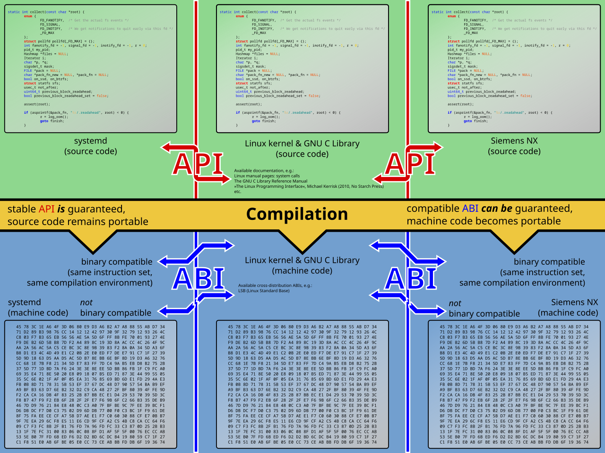

# <div align="center">高级特性</div>

## 1. Unsafe Rust

> 隐藏着第二个语言，没有强制的内存安全保证：Unsafe Rust
>
> Unsafe Rust存在的原因：
>
> * 静态分析是保守的（错杀代码，曹操行为）
> * 使用Unsafe Rust：我知道自己在做什么，并承担相应风险

* 使用``unsafe``关键字来切换到``unsafe Rust``，开启一个块，里面存放unsafe代码
* Unsafe Rust的超能力
  * 解引用原始指针
  * 调用unsafe函数或方法
  * 访问或修改可变的静态变量
  * 实现``unsafe trait``
* **unsafe并没有关闭借用检查或停用其他安全检查**
* 尽可能隔离unsafe代码，对外提供抽象接口

### 1.1 解引用原始指针

* 原始指针
  * 可变的：``*mut T``
  * 不可变的：``*const T``：在解引用后不能直接对其进行赋值
  * *不是解引用，是类型名的一部分
* 与引用不同，原始指针(约等于C指针)
  * 允许通过(同时具有不可变和可变指针或多个指向同一位置的可变指针)来忽略借用规则
  * 无法保证能指向合理的内存
  * 允许为null
  * 不实现任何自动清理
* 原始指针可以在unsafe外创建，但只能在``unsafe``块内解引用
* **与C语言进行接口**

### 1.2 调用unsafe函数或方法

* unsafe函数或方法：定义前加上了unsafe关键字
* 函数包含unsafe代码并不意味着要将整个函数标记为unsafe
* 将unsafe代码包裹在安全函数中是常见的抽象：**不安全代码的安全抽象**

### 1.3 有关FFI(Foriegn Function Interface)

* FFI:用一种编程语言能调用另一种编程语言写的函数
  * 在当前语言(host)中，调用其他语言(guest)提供的库
  * 当前语言(host)写库，其他语言(guest)调用

​	**关于FFI的原理：**我们知道所有语言在编译后都会以**二进制**方式执行，这为不同语言间调用提供了可能性。但是二进制太底层了，没有大家一致认可的调用约定，也不可能是互通的，于是出现了ABI(Application Binary Interface)。

​	**ABI(应用二进制接口)：是两个二进制程序模块间的接口(an interface between two program modules).** ABI定义了在机器码中如何获取数据结构和函数，在一个更低层次、更贴近硬件的层次。

> 对比API(Application Programming Interface)：可以理解为用户编程接口，在ABI的高层次



而 Rust 目前支持如下 ABI [约定](https://doc.rust-lang.org/nomicon/ffi.html)：

- stdcall
- aapcs
- cdecl
- fastcall
- vectorcall
- Rust
- rust-intrinsic
- system
- **C**
- win64
- sysv64

### 1.4 使用extern函数调用外部代码

* extern关键字：简化创建和使用外部函数接口(FFI)的过程
* 外部函数接口(``FFI:Foriegn Function Interface``)：他允许一种编程语言定义函数，并让其他编程语言能调用这些函数
* 应用二进制接口(``ABI:Application Binary Interface``)，定义函数在汇编层的调用方式
* "C" ABI就是最常见的ABI，它是遵循C语言的ABI(**Rust目前常用的编程语言只支持C**)
* 例如Rust调用C标准库中的abs函数

  ```rust
  extern "C" {
      fn abs(input: i32) -> i32; // 方法签名
  }
  
  fn main() {
      unsafe {
          println!("Absolute value of -3 according to C: {}", abs(-3));
      }
  }
  ```

  * 由于其他语言的函数不确定是否满足Rust的安全规则，故只能在unsafe代码中调用
* **从其他语言调用Rust函数：在fn关键字前使用extern接口，通过他们调用Rust函数**

  > Rust mangling：在编译时编译器会改变我们写的函数名，更改为包含更多编译信息的名字，每一种语言mangle的方式都有不同，为了使我们的函数可以被其他语言通过函数名识别出来，我们需要禁用Rust的mangle
  >
  > ```rust
  > // lib.rs
  > #[no_mangle]
  > pub extern "C" fn call_from_c() {
  >     println!("Just called a Rust function from C!");
  > }
  > ```
  >
  > ```c
  > extern void rust_function();
  > 
  > int main() {
  >     rust_function();
  >     return 0;
  > }
  > ```

  * 从c侧调用Rust需要Rust是一个``library crate``，更具体地说，需要在toml加入

    ```rust
    [lib]
    crate-type = ["cdylib"]
    ```

  * 使用``cargo build``编译好rust库后再编译c程序，并对编译好的Rust目标文件进行链接

    ```shell
    gcc main.c -o call_rust -lffi_demo -L./target/debug #编译
    LD_LIBRARY_PATH=./target/debug ./call_rust #运行
    ```

### 1.5 访问或修改一个可变静态变量

* Rust支持全局变量，但因为所有权机制可能产生某些问题，例如数据竞争

* Rust中，全局变量叫做静态变量(``static``)

* **全局变量命名规范为大写的SNAKE_CASE**

* 静态变量只能存储```static``生命周期的引用，无需显式标注

* 访问不可变静态变量是安全的

* **常量和不可变静态变量的区别**

  * 静态变量：有固定的内存地址，使用他的值总会访问相同的数据，可以是可变的，**访问和修改静态可变变量是不安全的**
  * 常量：允许使用他们的时候对数据进行复制

* 可变静态变量

  ```rust
  static mut COUNT:i32 = 0;
  ```

  * 读/写可变静态变量都要在unsafe块中

### 1.6 实现 unsafe trait

* 当某个trait中存在至少一个方法拥有编译器无法校验的不安全因素时，就称这个trait是不安全的

## 2. 高级Trait

### 2.1 在Trait定义中使用关联类型来指定占位类型

* 关联类型(associated type)是Trait中的类型占位符，他可以用于Trait的方法签名中

  * 定义出包含某些类型的trait,而在实现前不需要知道这些类型是什么

  ```rust
  pub trait Iterator {
      type Item;
  
      fn next(&mut self) -> Option<Self::Item>;
  }
  ```

* **关联类型和泛型的区别**

  | 泛型                                          | 关联类型                        |
  | --------------------------------------------- | ------------------------------- |
  | 每次实现Trait时标注类型                       | 无需标注类型                    |
  | 可以为一个类型多次实现某个Trait(不同泛型参数) | 无法为单个类型多次实现某个Trait |

### 2.2 默认泛型参数和运算符重载

* **可以在使泛型参数时为泛型指定一个默认的具体类型**
* 语法：``<PlaceholderType=ConcreteType>``
* 这种技术常用于运算符重载(``operator overloading``)
* Rust不允许创建自己的运算符以及重载任意的运算符，**但可以通过实现std::ops中列出的那些trait来重载一部分相应的运算符**

* 例如``Add Trait``的定义中

  ```rust
  pub trait Add<Rhs = Self> {
      /// The resulting type after applying the `+` operator.
      #[stable(feature = "rust1", since = "1.0.0")]
      type Output;
  
      /// Performs the `+` operation.
      ///
      /// # Example
      ///
      /// ```
      /// assert_eq!(12 + 1, 13);
      /// ```
      #[must_use = "this returns the result of the operation, without modifying the original"]
      #[rustc_diagnostic_item = "add"]
      #[stable(feature = "rust1", since = "1.0.0")]
      fn add(self, rhs: Rhs) -> Self::Output;
  }
  ```

  * ``Rhs = self``即为默认泛型参数，当我们实现``Add``重载时，默认类型就是自己的类型

    ```rust
    impl Add for Point {
        type Output = Point;
    
        fn add(self, other: Point) -> Self::Output {
            Point {
                x: self.x + other.x,
                y: self.y + other.y,
            }
        }
    }
    ```

  * **如果要实现不同类型的运算符重载，就要指明具体参数，而不能使用默认参数，在Add<>中指明运算的另一种类型**

    ```rust
    impl Add<Meters> for Millimeters {
        //code
    }
    ```

### 2.3 完全限定语法(Fully Qualified Syntax)如何调用同名方法

* 完全限定语法：``<Type as Trait>::function(receiver_if_method, next_arg, ...)``

### 2.4  使用supertrait来要求trait附带其他trait的功能

* 需要在一个trait中使用其他trait的功能

  * 需要被依赖的trait也被实现

* ```rust
  trait OutlinePrint: another_trait /*被依赖的trait*/ {
      
  }
  ```

### 2.5 使用newtype模式在外部类型上实现外部trait

* **孤儿规则：在为一个类型实现一个trait时，要求类型或trait至少有一个是在当前crate中定义的，或者说不能为第三方的类型实现第三方的crate**

  * 可以为外部类型实现自定义trait
  * 可以为自定义类型实现外部trait
  * 不可以为外部类型实现外部trait(会与前人的定义冲突)

* 可以通过newtype来绕过这一规则

  * 利用``tuple struct``创建一个新的类型（做一个包装）

    ```rust
    struct Wrapper(Vec<String>); // 做的包装实际上就是定义了新类型
    
    impl fmt::Display for Wrapper {
        // code
    }
    ```

## 3. 高级类型

### 3.1 使用newtype模式实现类型安全和抽象

* ``newtype``**模式换句话来说就是包装一下已有的类型 typedef**
  * 用来静态地保证各种值之间不会混淆并表明值的单位
  * 为类型的某些细节提供抽象能力
  * 通过轻量级的封装隐藏内部细节

### 3.2 使用类型别名创建类型同义词

* Rust提供了类型别名功能：``type``关键字

### 3.3 Never类型

* 名为``！``的特殊类型：空类型
* 我们倾向于叫他never类型，因为他在不返回值的函数中充当返回类型

### 3.4 动态大小和``Sized Trait``

* Rust需要在编译时确定为一个特定类型的值分配多少空间
* **动态大小的类型(Dynamically Sized Types, DST)**
  * **在编写代码时使用只有在运行时才能确定大小的值**
* ``str``是动态大小的类型，只有在运行时才能确定字符串长度
* **Rust使用动态大小类型的通用方式**
  * 附带一些额外的元素来存储动态信息的大小
  * 使用动态大小的类型时总会把它的值放在某种指针后边
* 另外一种动态大小的类型：``trait``
  * 每个trait都是一个动态大小的类型，可以通过名称对其进行引用
* **Sized Trait**
  * 为了处理动态大小的类型，Rust提供了一个Sized Trait来确定一个类型的大小在编译时是否已知
  * 编译时可计算出大小的类型会自动实现这一trait
* **？Sized Trait**
  * T可能是Sized,也可能不是

## 4. 高级函数和闭包

* **函数指针**
  * 可以将函数传递给其他函数
  * 函数在传递过程中会被强制转换成``fn``类型
* **函数指针与闭包的不同**
  * ``fn``是一个类型，不是一个``trait``
  * 函数指针实现了三种闭包(``Fn, FnMut, FnOnce``)
* **函数不能返回闭包，但是可以将一个实现了该trait的具体类型作为返回值**

## 5. 宏


